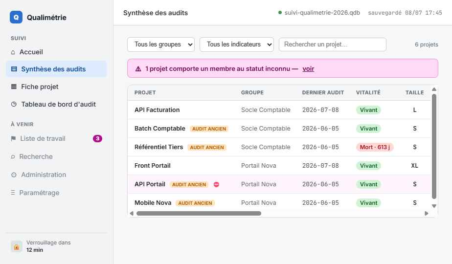

# Suivi Qualimétrie

Application de bureau qui suit et surveille, dans le temps, la qualimétrie et l'obsolescence des dépendances d'un grand nombre de projets répartis dans plusieurs groupes organisationnels, à partir des API de plusieurs instances GitLab et SonarQube.

[](./LICENSE)
[](https://github.com/talbotgui/suiviProjets/actions/workflows/validationVersionEtPublication.yml)


## Sommaire

1. [Aperçu](#aperçu)
2. [Qu'est-ce que c'est](#quest-ce-que-cest)
3. [Statut du projet](#statut-du-projet)
4. [Ce qui distingue ce projet](#ce-qui-distingue-ce-projet)
5. [Stack technique](#stack-technique)
6. [Installation](#installation)
   1. [Utilisatrice ou utilisateur](#utilisatrice-ou-utilisateur)
   2. [Développeuse ou développeur](#développeuse-ou-développeur)
7. [Documentation et méthode de construction](#documentation-et-méthode-de-construction)
8. [Avertissements](#avertissements)
9. [Licence](#licence)

## Aperçu



## Qu'est-ce que c'est

Un outil de bureau, 100 % local, sans serveur ni base de données : les audits interrogent GitLab et SonarQube, en historisent les constats et restituent des synthèses, des graphiques d'évolution et des alertes, projet par projet et en tendance. Toutes les données vivent dans un unique fichier JSON compressé puis chiffré, chargé et sauvegardé explicitement par l'utilisatrice ou l'utilisateur sur son poste (cf. [Spécification, section 1.1](docs/01_besoin/Specification.md#11-architecture-retenue)).

## Statut du projet

Projet personnel, développé seul, en cours de construction : aucun engagement de support ni de stabilité de version. Le développement est structuré en 15 phases documentées dans [le plan de développement](docs/03_plan/plan_13_developpement.md) ; les 12 premières, qui couvrent l'intégralité des [cas d'usage fonctionnels](docs/02_documentation/04_casUsage.md), sont closes, les phases suivantes (finition visuelle, intégration continue et publication, recette finale) sont en cours.

## Ce qui distingue ce projet

Quatre principes structurent l'ensemble de la conception (cf. [Spécification, section 1.2](docs/01_besoin/Specification.md#12-principes-de-conception)) :

- **le constat est stocké, le jugement est calculé** — les audits enregistrent des données brutes ; toute classification (statut d'obsolescence, vitalité, statut d'un membre...) est recalculée à l'affichage à partir des seuils et référentiels courants, sans nécessiter de nouvel audit ;
- **interdiction par défaut** — l'usage de l'IA sur un projet est interdit sauf autorisation explicite, un membre non reconnu est `inconnu`, l'absence de champ vaut la valeur la plus restrictive ;
- **les secrets ne sont jamais persistés** — les credentials GitLab et Sonar vivent exclusivement en mémoire volatile, ressaisis à chaque session ;
- **français intégral** — code, documentation, modèle de données et discriminants de type sont en français, à l'exception des valeurs imposées par les API externes.

Quelques fonctionnalités phares parmi les [26 fonctionnalités documentées](docs/01_besoin/Specification.md#3-résumé-des-fonctionnalités) : l'alerte **membre de dépôt inconnu**, qui court-circuite tous les autres seuils tant elle est prioritaire ; la détection de **marqueurs d'usage de l'IA** dans l'arborescence des dépôts, croisée avec la politique par projet ; la **comparaison entre deux audits** (indicateurs, dépendances, membres, marqueurs IA) ; le chiffrement du fichier de données par **Argon2id + AES-256-GCM**.

## Stack technique

Application [Tauri](https://tauri.app/) : le cœur natif en **Rust** assure les appels HTTP vers GitLab et Sonar (`reqwest`, hors CORS, proxy d'entreprise respecté) ainsi que la cryptographie et les accès disque (`argon2`, `aes-gcm`, `zstd`) ; l'interface en **Angular** (TypeScript, Signals, RxJS) restitue les synthèses et graphiques d'évolution (Chart.js) et propose des exports PNG (`html-to-image`). Détail complet dans [l'architecture technique](docs/02_documentation/11_architectureTechnique.md).

## Installation

### Utilisatrice ou utilisateur

Télécharger l'installeur correspondant à son système d'exploitation (Windows, macOS ou Linux) depuis les [Releases GitHub](https://github.com/talbotgui/suiviProjets/releases).

### Développeuse ou développeur

Cloner le dépôt, installer [Node.js](https://nodejs.org/) (version fixée par `.nvmrc`) et [Rust](https://www.rust-lang.org/) via [rustup](https://rustup.rs/) (version fixée par `rust-toolchain.toml`), puis :

```
npm ci
npm run tauri dev
```

Détail complet, dépendances système du webview et variables d'environnement dans [le guide du poste développeur](docs/02_documentation/17_posteDeveloppeur.md).

## Documentation et méthode de construction

- [Documentation technique](docs/02_documentation/) : besoin, exigences, architecture, modèle de données, normes de développement, de sécurité et de tests, poste développeur, intégration continue.
- [Site documentaire, rapports de couverture de code et de documentation technique](https://me.guillaumetalbot.com/suiviProjets/).

Ce projet est autant une démonstration de méthode qu'un outil : l'ensemble de la conception a été cadré en amont, en français, à travers une discussion structurée en 15 étapes pilotée par [un prompt de cadrage réutilisable](docs/00_init&prompt/00_promptInitial.md), chaque étape produisant des documents relus dans une session isolée puis validés explicitement par un humain avant de passer à la suivante. Le développement lui-même est dérivé exclusivement de cette documentation (jamais du dossier de besoin, à l'exception des feuilles de style) et suit le même principe binôme, incrément par incrément : un « Codeur » développe, un « Relecteur » relit dans un contexte isolé du raisonnement du Codeur, consigné dans le [rapport de développement](docs/04_rapports/rapportDeDeveloppement.md). Chaque exigence porte un identifiant stable (`US-NNN`, `RG-NNN`) tracé sans rupture depuis le besoin jusqu'aux tests.

## Avertissements

Le mot de passe du fichier de données n'est **pas récupérable** en cas de perte : aucun mécanisme de recouvrement n'existe, par conception. Il est recommandé de le conserver dans un gestionnaire dédié tel que [KeePass](https://keepass.info/) (cf. [guide utilisateur](docs/02_documentation/20_guideUtilisateur.md#questions-fréquentes)). L'application constate et restitue ; elle ne corrige jamais automatiquement les dépendances, la qualité ou les accès qu'elle observe.

## Licence

[GNU GPL v3.0](./LICENSE).
