# Guide utilisateur

Ce guide décrit la prise en main complète de l'application, écran par écran, depuis la création d'un fichier de données jusqu'à l'exploitation des résultats d'audit. Il s'adresse à l'utilisatrice ou l'utilisateur unique de l'outil, sans prérequis technique au-delà de la connaissance de ses propres groupes et projets GitLab et SonarQube.

Les captures d'écran proviennent de l'application réelle, alimentée par un jeu de données de démonstration entièrement fictif (deux groupes, « Socle Comptable » et « Portail Nova », et six projets). Pour la référence normative, exhaustive et sans illustration, de chaque écran, voir le [guide utilisateur et aide en ligne](02_documentation/20_guideUtilisateur.md) de la documentation ; pour les parcours détaillés, voir les [parcours utilisateurs](02_documentation/06_parcoursUtilisateurs.md).

## Sommaire

1. [Principes à connaître avant de commencer](#principes-à-connaître-avant-de-commencer)
2. [Démarrer : créer ou charger un fichier de données](#démarrer--créer-ou-charger-un-fichier-de-données)
3. [Fournir les accès : la gestion des credentials](#fournir-les-accès--la-gestion-des-credentials)
4. [Constituer son périmètre : l'administration](#constituer-son-périmètre--ladministration)
5. [Adapter l'outil à son contexte : le paramétrage](#adapter-loutil-à-son-contexte--le-paramétrage)
6. [Lancer un audit : la campagne](#lancer-un-audit--la-campagne)
7. [Exploiter les résultats](#exploiter-les-résultats)
8. [Traiter les alertes : la liste de travail](#traiter-les-alertes--la-liste-de-travail)
9. [Au quotidien : recherche, sauvegarde, verrouillage](#au-quotidien--recherche-sauvegarde-verrouillage)
10. [Questions fréquentes](#questions-fréquentes)

## Principes à connaître avant de commencer

L'application est un outil de bureau, cent pour cent local, sans serveur ni base de données. Toutes les données vivent dans un unique fichier chiffré (extension `.sqm`) que vous chargez et sauvegardez explicitement depuis votre poste.

Quatre principes structurent l'usage quotidien :

- le constat est stocké, le jugement est calculé : un audit n'enregistre que des données brutes ; les couleurs, les statuts d'obsolescence, la vitalité d'un dépôt ou le statut d'un membre sont recalculés à l'affichage à partir des seuils et référentiels courants. Modifier un seuil requalifie immédiatement tout l'historique déjà intégré, sans nouvel audit.
- interdiction par défaut : l'usage de l'IA sur un projet est interdit tant qu'il n'a pas été explicitement autorisé, un membre non reconnu est `inconnu`, et l'absence d'une information vaut la valeur la plus restrictive.
- les secrets ne sont jamais persistés : les credentials GitLab et Sonar ne vivent qu'en mémoire pour la durée de la session et sont ressaisis à chaque ouverture (RG-004).
- le mot de passe protège tout : il est redemandé à chaque chargement et à chaque écriture sur le disque (RG-002), et il n'existe aucun mécanisme de récupération.

## Démarrer : créer ou charger un fichier de données

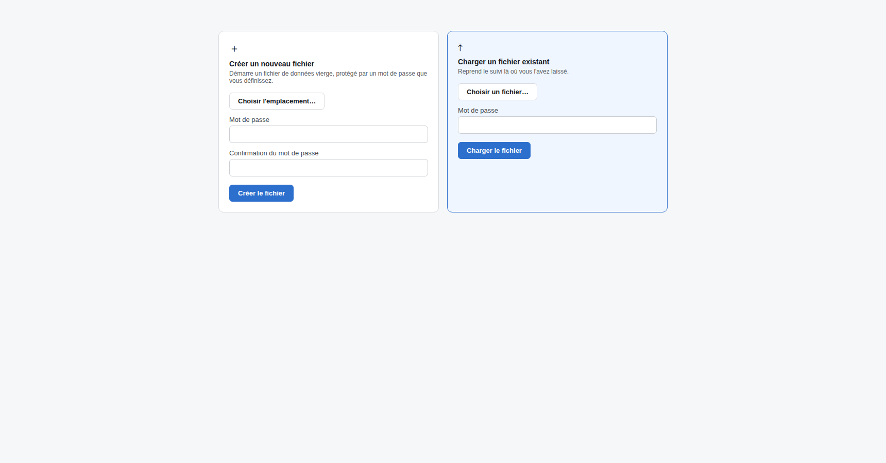

L'écran de démarrage est le point d'entrée tant qu'aucun fichier n'est ouvert. Il propose deux actions.

Pour créer un nouveau fichier : cliquer sur « Choisir l'emplacement… » (une boîte de dialogue native de votre système s'ouvre ; l'application ne permet jamais de saisir un chemin à la main), puis renseigner un mot de passe et sa confirmation. Le bouton « Créer le fichier » n'est actif que si l'emplacement est choisi et les deux mots de passe identiques. À la création, l'application s'ouvre directement sur l'écran d'administration pour la première configuration.

Pour reprendre un suivi : cliquer sur « Choisir un fichier… », sélectionner votre fichier `.sqm`, saisir son mot de passe, puis « Charger le fichier ». Après un chargement réussi, l'application s'ouvre sur la liste de travail s'il existe des alertes non traitées, sinon sur la synthèse des audits.

Le mot de passe choisi à la création n'est jamais récupérable : sans lui, les données sont définitivement inaccessibles. Il est vivement recommandé de le conserver dans un gestionnaire de mots de passe dédié.

## Fournir les accès : la gestion des credentials

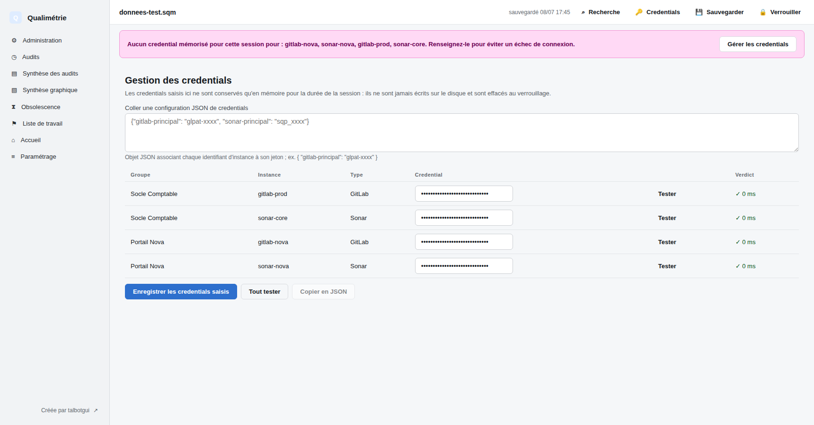

L'écran de gestion des credentials s'ouvre depuis le bouton « Credentials » de la barre supérieure. Il présente une ligne par instance GitLab ou Sonar déclarée dans vos groupes.

Pour chaque instance, saisir le jeton d'accès dans le champ « Credential », puis cliquer sur « Tester » pour vérifier la connectivité : le verdict affiche la latence en millisecondes, ou une anomalie accompagnée d'une action suggérée, ou un avertissement si la portée du jeton est trop large. Le bouton « Tout tester » vérifie en une fois toutes les instances renseignées. Le champ « Coller une configuration JSON de credentials » permet de remplir tous les champs d'un coup à partir d'un objet associant chaque identifiant d'instance à son jeton.

« Enregistrer les credentials saisis » conserve les jetons en mémoire pour la durée de la session uniquement : ils ne sont jamais écrits sur le disque et sont effacés au verrouillage, à la fermeture et après le délai d'inactivité. Un bandeau rose rappelle, sur tous les écrans, tant qu'au moins une instance référencée reste sans credential mémorisé (RG-037). Il est recommandé d'utiliser des jetons en lecture seule, à la portée minimale.

## Constituer son périmètre : l'administration

L'écran d'administration est organisé en trois onglets : Groupes, Projets, Sources. C'est ici que se construit l'arborescence de ce que l'outil surveille.

### Groupes, membres connus et annotations

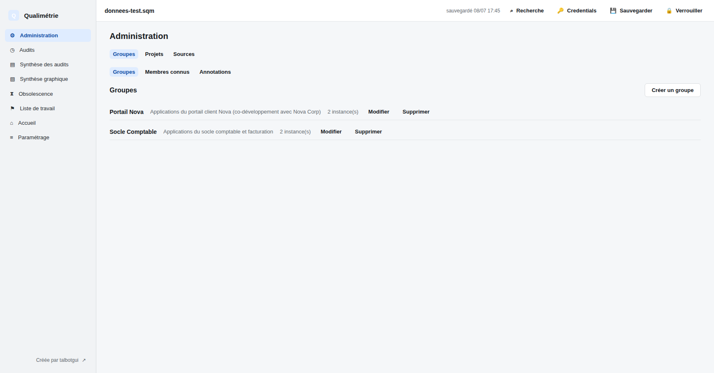

Un groupe porte un nom, une description et la liste de ses instances GitLab et Sonar (type, nom, URL de base). Les instances déclarées ici alimentent ensuite la liste de l'écran des credentials et la liste déroulante des sources.

Le sous-onglet « Membres connus » gère les règles d'identification des membres d'un groupe : un critère (nom d'utilisateur, adresse électronique complète ou domaine de messagerie), son type, et le statut associé (`interne`, `client` ou `partenaire`). Ces règles permettent de qualifier par anticipation des personnes qui apparaîtront dans les futurs audits. La précédence est : nom d'utilisateur exact, puis adresse exacte, puis domaine. Deux règles de même niveau produisant des statuts contradictoires donnent un « conflit de règles », traité comme `inconnu` (RG-008).

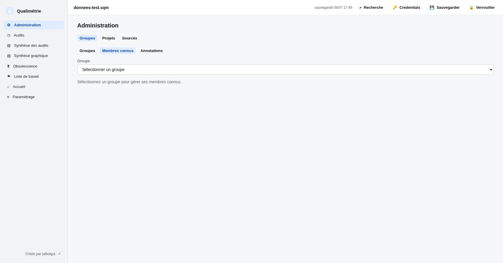

Le sous-onglet « Annotations » gère des annotations datées de portée groupe (une date, un libellé, une catégorie), qui apparaîtront comme repères sur les graphiques d'évolution.

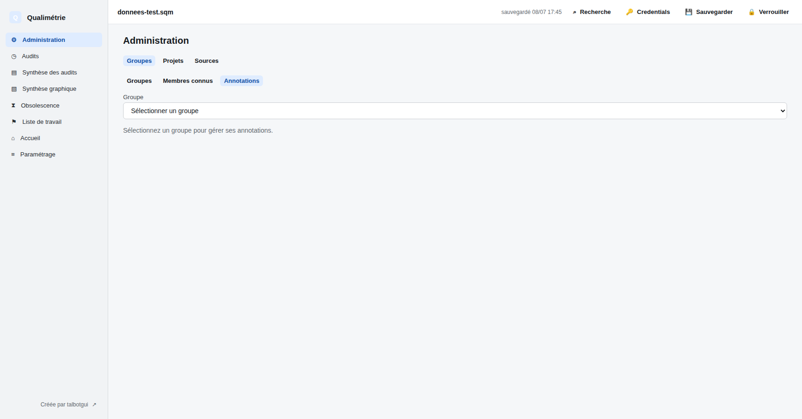

### Projets et politique IA

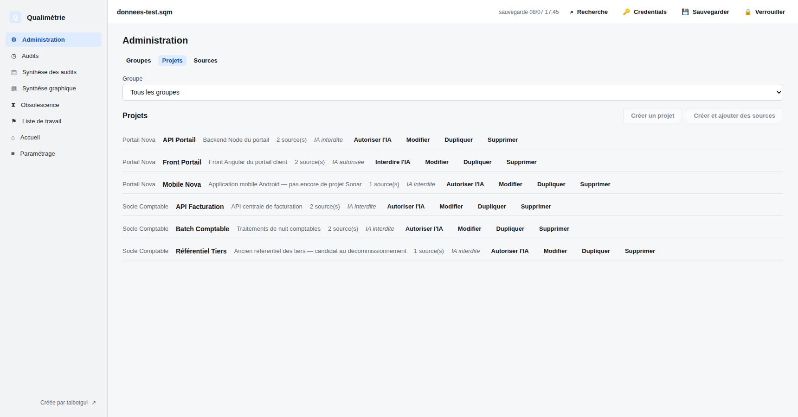

Après avoir sélectionné un groupe, on crée, modifie, duplique ou supprime ses projets. Chaque projet porte un nom, une description et une politique d'usage de l'IA, interdite par défaut : l'autorisation explicite est une décision qui déclenche une écriture du fichier et donc la ressaisie du mot de passe (RG-014). Supprimer un projet supprime aussi tout son historique d'audits.

### Sources

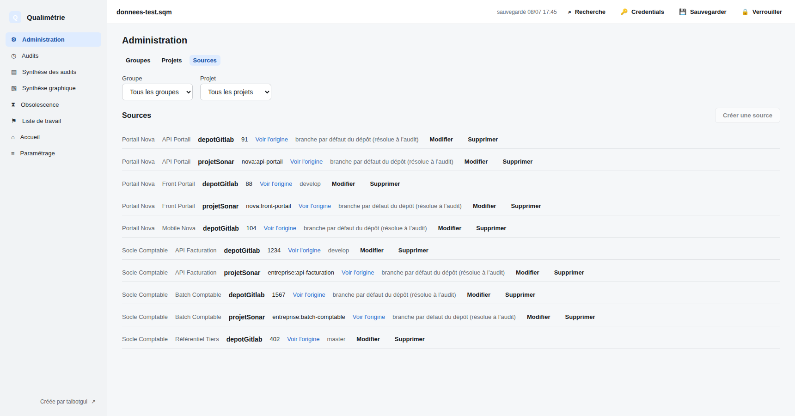

Une source rattache un dépôt GitLab ou un projet Sonar d'une instance à un projet. Pour un dépôt GitLab, on précise l'instance, l'identifiant externe (avec autocomplétion) et la ref auditée (par exemple `main`, un tag ou un SHA). Pour un projet Sonar, l'instance et la clé du projet suffisent.

### Métriques

L'onglet Métriques présente, en lecture seule, la volumétrie du fichier de données ouvert : le nombre de groupes, de projets, d'audits, de règles de membre et de règles de dépendance, le poids du fichier chiffré sur disque (celui de la dernière sauvegarde), le poids du contenu en clair et sa répartition en pourcentage sur cinq postes — paramétrage, journal, administration, audits, autre. Cet onglet ne modifie rien et ne demande jamais le mot de passe ; il aide à décider si une purge des audits ou du journal est utile.

## Adapter l'outil à son contexte : le paramétrage

L'écran de paramétrage regroupe cinq onglets. Chaque section indique explicitement le moment où une modification prend effet (RG-039), et toute modification redemande le mot de passe du fichier.

### Seuils et référentiels

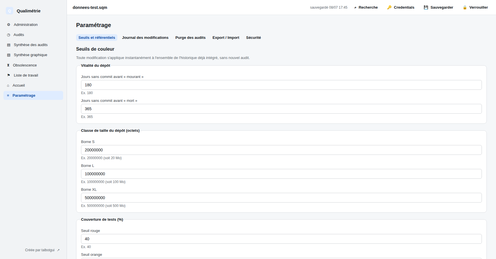

L'onglet « Seuils et référentiels » réunit trois cadres :

- Seuils de couleur : les valeurs numériques qui déterminent les couleurs de jugement (vitalité du dépôt, classes de taille, couverture de tests, fraîcheur d'analyse Sonar, âge des merge requests, seuils de violations, matérialité du brouillon…). Toute modification s'applique instantanément à l'ensemble de l'historique déjà intégré.
- Référentiels : les règles de statut des dépendances (motif et bornes de version), les marqueurs d'usage de l'IA à détecter, les catégories de dépendance (`exec`, `os`, `fmkBack`, `fmkFront` par défaut, RG-048) et le motif d'expression régulière de nommage des branches, initialisé à la convention Gitflow (RG-030).
- Réglages applicatifs : délai de verrouillage sur inactivité, concurrence d'audit par défaut, proxy sortant, nombre de sauvegardes de sécurité conservées, seuil d'avertissement de taille du fichier à la sauvegarde.

### Journal des modifications

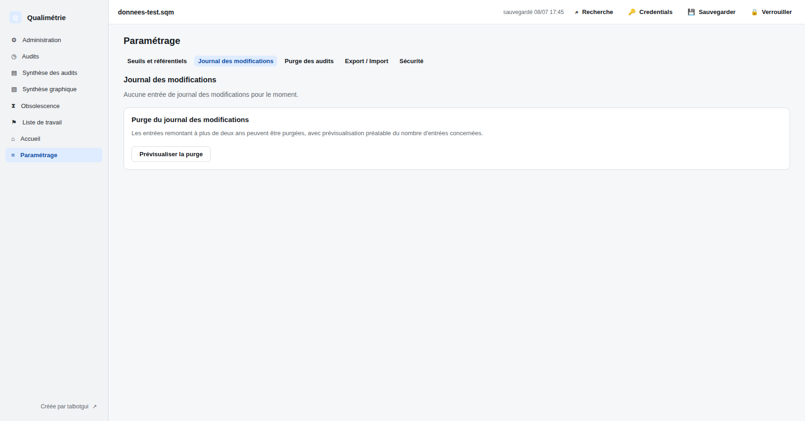

Le journal recense en lecture seule toutes les modifications de configuration (seuils, référentiels, qualification de membres, politique IA, ref auditée…), filtrable par origine et par intervalle de dates. Sa purge est limitée à deux ans et se fait après prévisualisation.

### Purge des audits

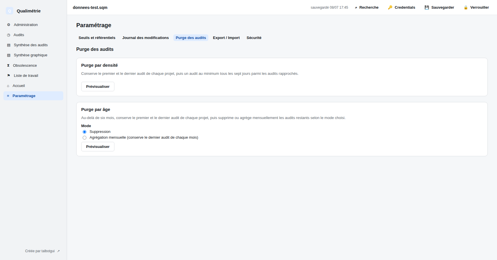

Deux purges sont proposées, jamais automatiques et toujours précédées d'une prévisualisation du volume libéré : par densité (audits trop rapprochés) et par âge (au-delà de six mois, au choix par suppression ou par agrégation mensuelle).

### Export / Import de configuration

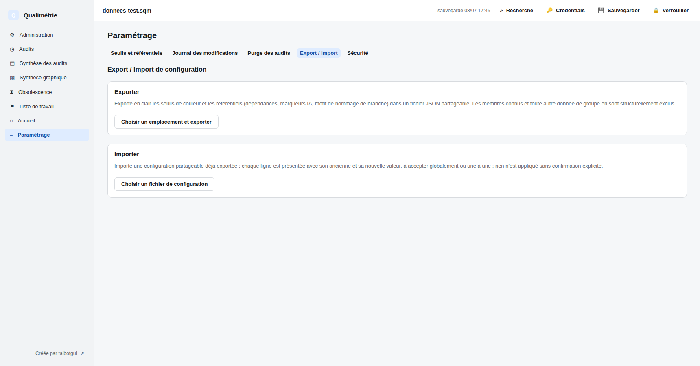

L'export produit un fichier JSON en clair contenant les seuils et les référentiels, destiné à être partagé avec une autre installation. L'import affiche un différentiel explicite (ajouts, modifications, lignes identiques) et s'applique de façon transactionnelle. L'export ne contient jamais de donnée propre à un groupe, en particulier aucun membre connu.

### Sécurité

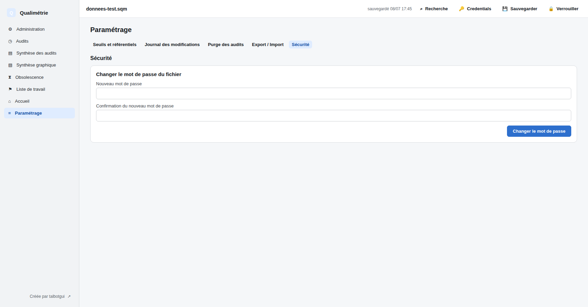

L'onglet Sécurité permet de changer le mot de passe du fichier ouvert (RG-038). Le nouveau mot de passe est demandé et confirmé, l'ancien est revérifié, et le fichier est immédiatement réécrit ; par exception, les sauvegardes de sécurité existantes, chiffrées avec l'ancien mot de passe, sont alors supprimées.

## Lancer un audit : la campagne

Le parcours d'audit se déroule en trois écrans, accessibles par l'entrée « Audits » de la barre latérale.

### Constitution de campagne

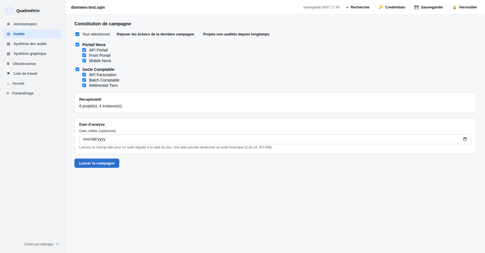

On choisit le périmètre à auditer : tout, un ou plusieurs groupes, une sélection manuelle de projets, ou un raccourci (« Rejouer les échecs de la dernière campagne », « Projets non audités depuis longtemps »). Le récapitulatif indique le nombre de projets et d'instances concernés, et signale en orange les credentials manquants. Le champ « Date ciblée » reste vide pour un audit régulier daté du jour ; une date passée déclenche un audit historique, au périmètre d'indicateurs réduit (RG-046). Le lancement redemande le mot de passe, puis bascule immédiatement sur le tableau de bord sans attendre la fin.

Le lancement d'une nouvelle campagne est impossible tant qu'un brouillon précédent n'a pas été traité (RG-019).

### Tableau de bord d'exécution

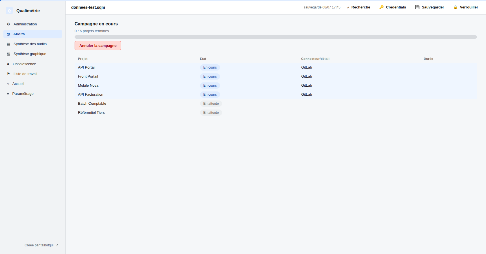

Le tableau de bord suit la campagne en temps réel : barre de progression globale, compteur de projets terminés, et état de chaque projet (en attente, en cours, terminé, échoué, ignoré). Le bouton « Annuler la campagne » vide proprement la file d'attente sans interrompre les requêtes en vol et conserve les résultats déjà obtenus (RG-018). Passer à un autre écran n'interrompt pas la campagne.

### Brouillon et rapport d'anomalies

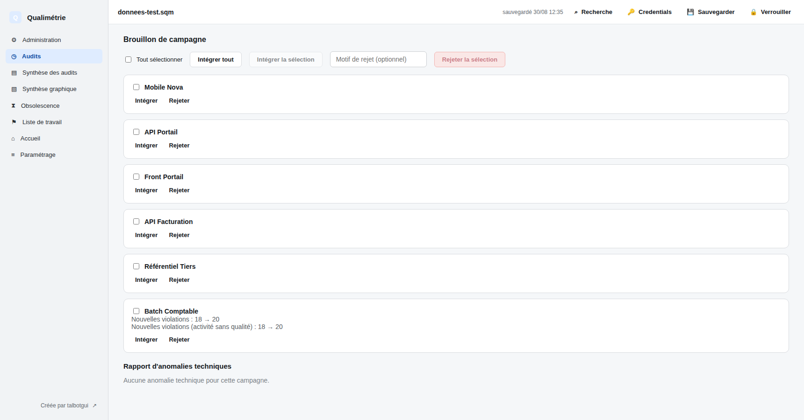

À la fin d'une campagne, un brouillon présente, projet par projet, le différentiel par rapport au dernier audit intégré, et signale automatiquement les variations jugées aberrantes (RG-020). On peut alors intégrer tout, intégrer projet par projet, ou rejeter avec un motif. Le rapport d'anomalies techniques regroupe les erreurs d'exécution par cause commune, chacune typée et accompagnée d'une action suggérée (RG-021). Tant que le brouillon n'est pas entièrement traité, aucune nouvelle campagne n'est possible.

## Exploiter les résultats

### Accueil

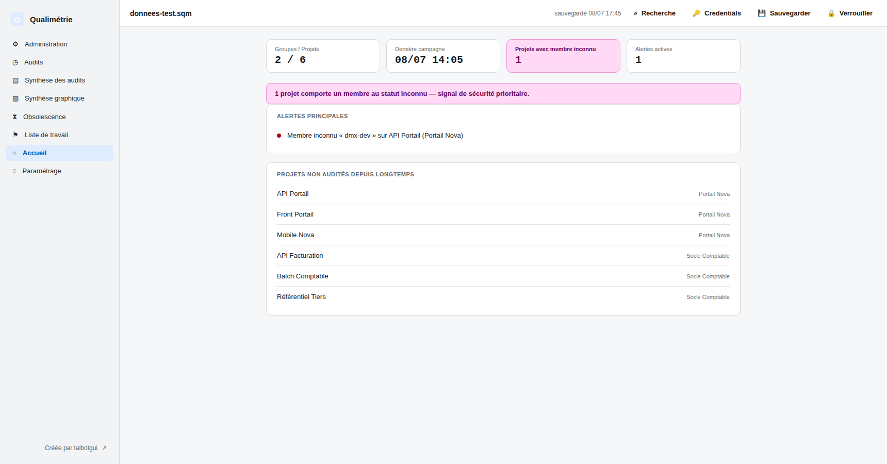

L'écran d'accueil, accessible depuis la barre latérale, est un résumé de la session en cours : le nombre de groupes et de projets, la date de la dernière campagne, le nombre de projets comportant un membre inconnu et le nombre d'alertes actives, un bandeau prioritaire tant qu'un membre inconnu existe (RG-009), les alertes les plus importantes, et la liste des projets non audités depuis longtemps. Il ne comporte aucune action de création ou de chargement de fichier : celles-ci se trouvent sur l'écran de démarrage.

### Synthèse des audits

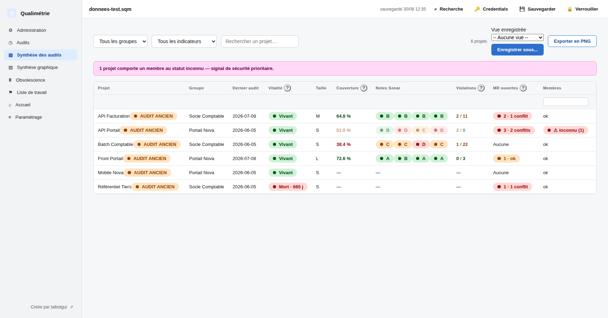

La synthèse présente le dernier audit intégré de chaque projet dans un tableau dense, filtrable par groupe et par indicateur. Les alertes « membre inconnu » sont toujours affichées au-dessus du tableau, quel que soit le filtre (RG-009). Une vue (combinaison de filtres) peut être enregistrée pour être rappelée plus tard, et la vue courante peut être exportée en image. Un clic sur une ligne ouvre la fiche du projet.

### Fiche projet

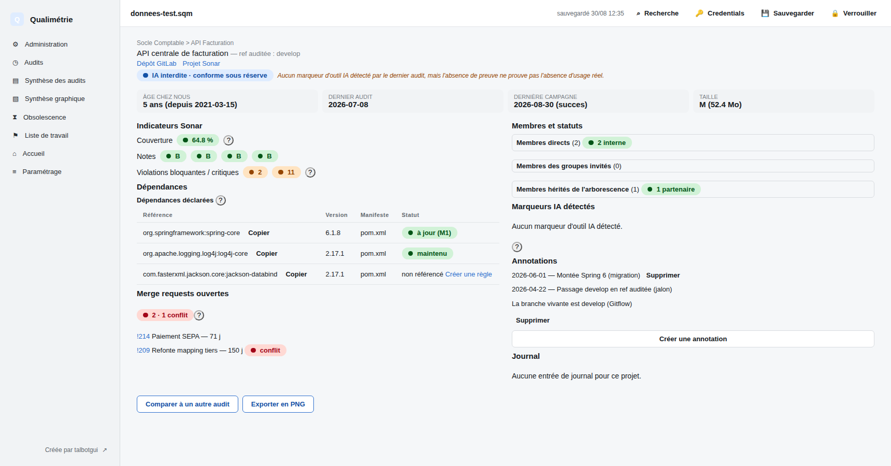

La fiche projet réunit tout ce qui concerne un projet : en-tête avec badges de statut (violation de politique IA, incohérence Sonar, membre inconnu), métadonnées (âge du dépôt, dernier audit, dernière campagne, taille), indicateurs Sonar, dépendances et leur statut, merge requests ouvertes, membres et statuts (avec le lien « Qualifier ce membre » vers l'administration), marqueurs IA détectés, annotations et journal du projet. Les dépendances sont regroupées par écosystème dans des sections repliables — « Maven » (dont la version de Java), « NPM », et « Autres » lorsqu'un manifeste n'est pas reconnu — fermées par défaut, chaque titre rappelant le nombre de dépendances et leur répartition par statut. Depuis cette fiche, on ouvre la comparaison entre deux audits et on exporte la vue en image (l'export déplie les sections repliables).

### Comparaison entre deux audits

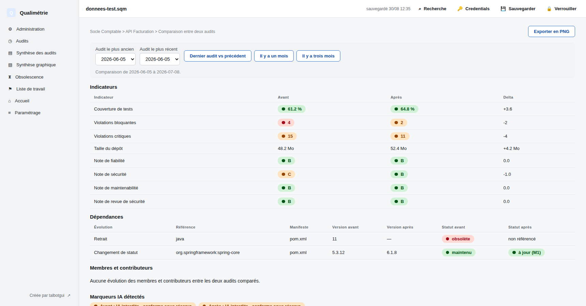

On choisit deux dates d'audit, ou un raccourci (« Dernier audit vs précédent », « Il y a un mois », « Il y a trois mois »), et le différentiel est présenté en quatre volets : indicateurs, dépendances, membres et contributeurs, marqueurs IA. Le volet dépendances est lui aussi regroupé par écosystème (Maven, NPM, Autres) dans des sections repliables, chaque titre rappelant le nombre d'ajouts, de retraits et de changements de statut. Le différentiel est recalculé sur les référentiels courants, et les annotations de l'intervalle sont rappelées.

### Synthèse graphique

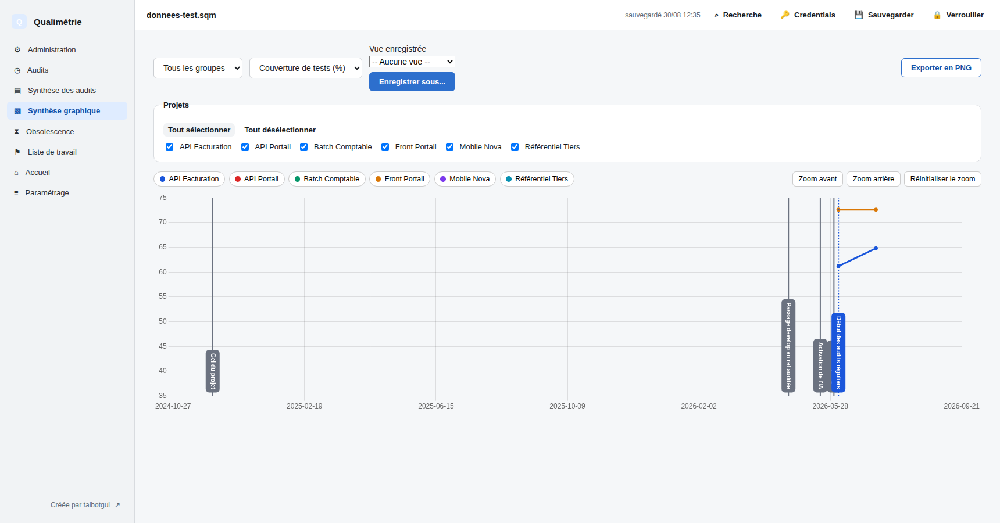

La synthèse graphique trace l'évolution d'un indicateur dans le temps, projet par projet, avec zoom et superposition. Les annotations de groupe et de projet apparaissent en repères verticaux. Au moins deux audits intégrés sont nécessaires pour tracer une évolution.

### Obsolescence

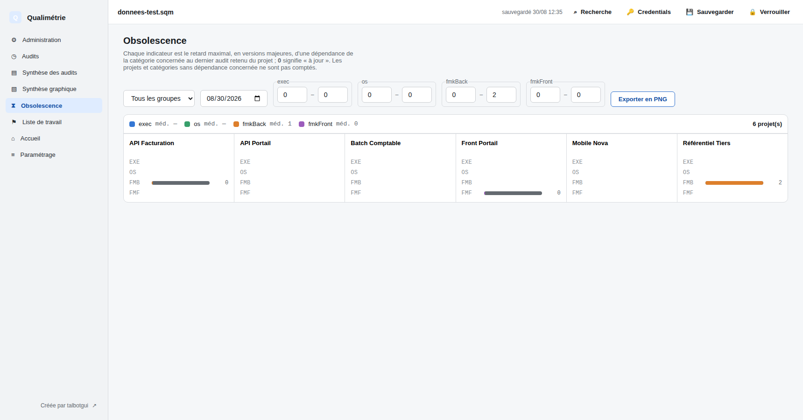

L'écran d'obsolescence présente une grille de tuiles, une par projet, indiquant le retard maximal en versions majeures pour chaque catégorie de dépendance au dernier audit retenu (`0` signifie « à jour »). Les filtres min/max par catégorie et la date de référence permettent de cibler l'analyse ; un clic sur une tuile ouvre le détail du dernier audit du projet.

## Traiter les alertes : la liste de travail

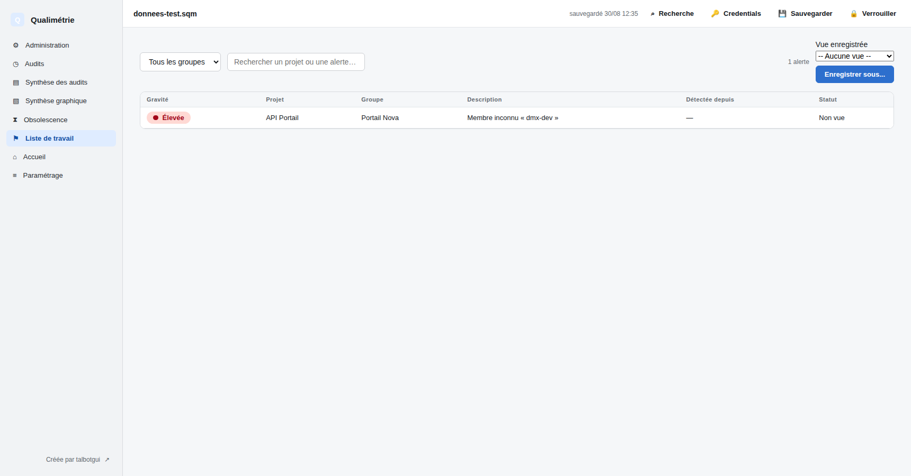

La liste de travail regroupe toutes les alertes actives, les membres inconnus toujours en tête (RG-009). Un clic sur une alerte ouvre un panneau de traitement où on la marque « vue » ou « traitée », avec un commentaire. Le bouton « Ouvrir la fiche projet » mène au projet concerné. Une alerte traitée qui persiste au constat suivant réapparaît, avec la mention de son traitement antérieur.

Le parcours de qualification d'un membre inconnu part généralement d'ici : depuis la fiche projet ouverte, déplier les sections de membres, cliquer sur « Qualifier ce membre », ce qui ouvre l'administration des membres connus pré-remplie ; il reste à choisir le statut et à enregistrer.

## Au quotidien : recherche, sauvegarde, verrouillage

### Recherche transversale

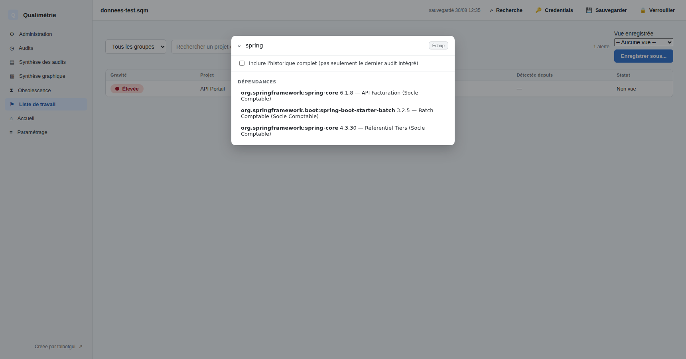

La recherche transversale s'ouvre depuis la barre supérieure ou par le raccourci clavier (Ctrl+K ou Cmd+K), depuis n'importe quel écran. Elle répond à des questions ponctuelles (« qui utilise encore cette dépendance ? », « où ce marqueur d'IA est-il présent ? ») et regroupe les résultats par nature : dépendances, membres, outils IA, entités structurelles. L'option « Inclure l'historique complet » étend la recherche au-delà du dernier audit intégré.

### Sauvegarde

Le bouton « Sauvegarder » de la barre supérieure écrit le fichier sur le disque après ressaisie du mot de passe (RG-002). Le statut de sauvegarde (« sauvegardé » suivi de la date et de l'heure) est affiché en permanence dans la barre supérieure. Un bandeau d'avertissement apparaît si le fichier dépasse le seuil de taille configuré.

### Verrouillage et déverrouillage

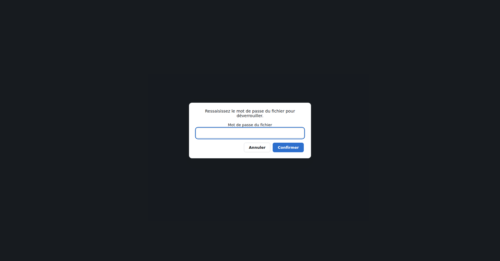

Le verrouillage protège les données en cas d'absence du poste : il masque tout l'écran et efface les credentials de session. Il se déclenche manuellement par le bouton « Verrouiller », ou automatiquement après le délai d'inactivité paramétrable. Le déverrouillage impose de ressaisir le mot de passe du fichier, puis de renseigner à nouveau les credentials.

## Questions fréquentes

| question | réponse |
|---|---|
| J'ai oublié le mot de passe de mon fichier de données, comment le récupérer ? | Il n'existe aucun mécanisme de recouvrement, par conception : le chiffrement rendrait sinon les données vulnérables. Conservez ce mot de passe dans un gestionnaire dédié tel que [KeePass](https://keepass.info/). |
| Pourquoi un membre reste-t-il « inconnu » après que je l'ai qualifié ? | Vérifiez que la règle créée correspond exactement au nom d'utilisateur ou à l'adresse observés sur l'audit ; en cas de règle contradictoire de même niveau, le statut retombe à « conflit de règles », traité comme inconnu (RG-008). |
| Que signifie un badge Sonar grisé sur un projet ? | La dernière analyse Sonar est trop ancienne par rapport au dernier commit ; les métriques Sonar affichées ne reflètent plus l'état réel du code et sont grisées jusqu'à ce qu'une analyse plus récente soit disponible. |
| Un projet où l'IA est interdite et sans marqueur détecté est-il garanti sans usage d'IA ? | Non : l'absence de marqueur prouve l'absence de configuration commitée, pas l'absence d'usage réel. Cette réserve est rappelée dans l'aide contextuelle de la fiche projet. |
| Puis-je utiliser l'application sur plusieurs postes ? | Oui, en transportant le fichier de données chiffré d'un poste à l'autre ; il n'existe pas de synchronisation automatique entre plusieurs postes utilisés en parallèle. |
| Que se passe-t-il si je ferme l'application pendant une campagne d'audit ? | Les résultats non encore intégrés sont perdus ; utilisez l'annulation propre plutôt que de fermer l'application brutalement. |
| Comment partager mes seuils et référentiels avec une autre installation ? | Utilisez l'export de configuration depuis le paramétrage, puis l'import sur l'autre installation ; seules les données de groupe, dont les membres connus, restent propres à chaque installation. |
